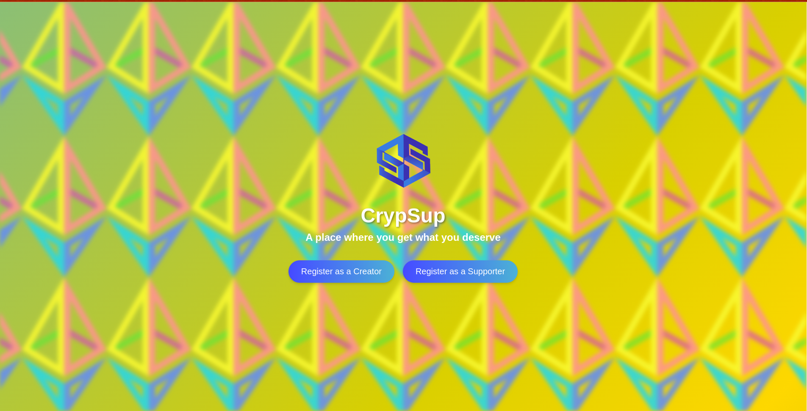
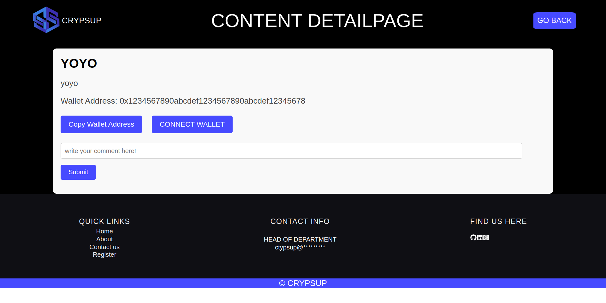

# Crypsup - Empowering Creators and Supporters ✨


## Introduction

Crypsup is a revolutionary platform designed to empower creators within the cryptocurrency community. It provides a seamless way for supporters to contribute through cryptocurrency donations, fostering a symbiotic relationship where creators can thrive and supporters can directly influence the growth and success of their favorite content creators.

<p align="center">
    
</p>

## Creator Side

1. **Content Posting:** Creators can effortlessly post their content on our platform, whether it's blogs, videos, podcasts, or any other form of creative work. Our intuitive interface makes it easy to upload, manage, and share content with a global audience.

2. **Revenue Tracking:** Creators can track their earnings in real-time, giving them clear insights into their income from cryptocurrency donations. This feature helps creators understand their audience better and plan their content strategy accordingly.

3. **Customizable Profiles:** Each creator can personalize their profile to reflect their brand, showcasing their work and engaging with their community more effectively.

<p align="center">
    
</p>

## Supporter Side

1. **View and Support:** Supporters can browse through a diverse range of content from various creators. Our platform offers a user-friendly experience, making it easy for supporters to find, enjoy, and contribute to the creators they love.

2. **Seamless Donation Process:** Crypsup ensures a smooth and secure donation process. Supporters can choose from multiple cryptocurrencies to make their contributions, providing flexibility and ease of use. Our platform handles all the technicalities, ensuring that donations are transferred safely and promptly.

3. **Engagement and Feedback:** Supporters can leave comments and feedback, fostering a community where creators and supporters can interact and grow together. This engagement helps creators refine their content and build a loyal supporter base.

<p align="center">
    
</p>

## Installation

1. Clone the Repository:

```bash
git clone https://github.com/sarthaksarthak9/Crypsup.git
cd Crypsup
```

2. Install the dependencies

```bash
cd client && npm install
cd server && npm install
```

3. Run the development server

```bash
cd client && npm run dev
cd server && npm run start
cd connectWallet && npm run start 
```
## How to contribute ?

Thank you for considering contributing to this project! We welcome your contributions and support in making this project better.

Contributions are welcome in the form of bug reports, feature requests, code changes, documentation updates, and more. To get started, please follow these steps:

1. **Create an Issue:**

   - If you find a bug or have a feature request, please create an issue.
   - Provide as much detail as possible, including the version of the project where you encountered the issue, your operating system, and steps to reproduce the problem.

2. **Fork the Repository:**

   - If you plan to make code contributions, fork the repository to your GitHub account.

3. **Make Changes:**

   - Create a new branch for your changes: `git checkout -b feature/your-feature` or `fix/your-fix`.
   - Make your changes, ensuring that your code follows the project's coding guidelines and standards.

4. **Test Your Changes:**

   - Ensure that your changes work as expected and do not introduce new issues.

5. **Submit a Pull Request:**

   - When you're ready to submit your changes, create a pull request from your fork to the main repository's `master` branch (or the relevant target branch).
   - In the pull request, provide a clear description of your changes and reference any related issues.

6. **Code Review:**

   - Your pull request will be reviewed by project maintainers. Please be responsive to any feedback or requested changes.

7. **Merge and Release:**
   - Once your changes are approved, they will be merged into the project. 


